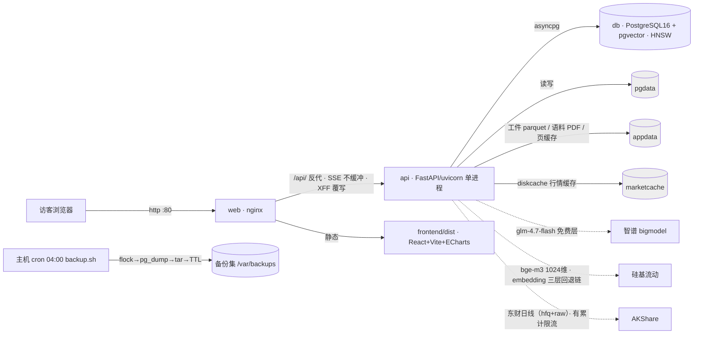
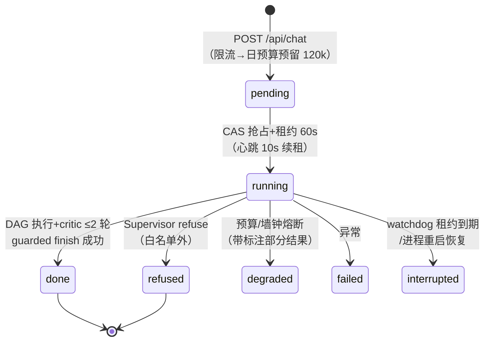
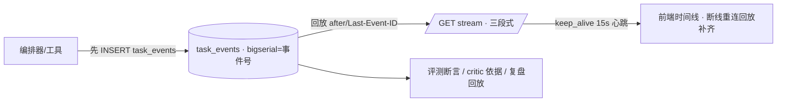
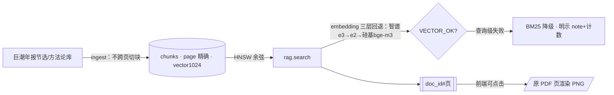

# AlphaDesk 架构说明（M6，2026-08-17）

> 部署形态：单机 Docker Compose 三容器（db/api/web），新加坡轻量服务器，线上 http://43.156.248.38。
> 代码唯一权威来源：`docs/BLUEPRINT.md`（v31）；决策依据：`docs/adr/`。

## 1. 系统拓扑



- **安全面**：`/api/admin/` 与 `/metrics` 外部 403（admin 三重：nginx deny + 回环端口 + token fail-closed）；api 仅绑 127.0.0.1:8000；IP 滑窗限流 20 次/时（nginx 覆写 XFF 防伪造）。

## 2. 任务生命周期（Multi-Agent 编排内核）



**编排结构**：Supervisor（glm-4.6*）→ DAG（≤6 节点：research/strategy/writer，串行拓扑序）→ critic 审查回路（≤2 轮 revise）→ 终态。*免费运行模式下经 env 全量切 glm-4.7-flash。

```mermaid
flowchart TB
    subgraph 单节点循环（agent_loop，步数=spec.max_steps）
        L[llm.chat] -->|tool_calls| T[工具执行：market/engine/artifact/rag]
        T -->|句柄+摘要截断| L
        L -->|纯文本| OUT[节点输出→黑板 context]
    end
```

- **黑板与句柄化**（ADR-0008）：LLM 上下文只含 artifact_id+摘要，完整数据经 ArtifactStore 服务端流转；工具集按 AgentSpec 白名单。
- **终态序列**（不变式 3/7）：guarded finish 成功 → 终态事件 → 释放预留；finish 冲突（已被 watchdog 迁移）→ 只记 M_TASK_CONF，不重复释放。

## 3. 事件流（单一事实源）



- 订阅队列有界（溢出→stream_overflow→客户端携 after 重连回放，事件最终不丢）。

## 4. 知识库与检索（RAG）



## 5. 回测确定性链（ADR-0004/0007）

自然语言 → Supervisor/strategy 翻译 → **pydantic 精确 Schema（extra=forbid）** → DSL 编译（hfq 全链路，无 eval/exec）→ 向量化引擎（fill→shift 契约，next_close 默认）→ 指标+净值+assumptions 脚注。可复现三元组：`{strategy_spec, price_artifact_id, engine}`——终版评测复算 10/10 全真。

## 6. 观测与预算

- /metrics（回环）：请求/token/任务终态/预算熔断/溢出/事件失败/finish 冲突/embedding 探针/RAG 查询级降级/critic fail-open
- usage_day：预留式日预算 2M（reserve→release，释放权归状态迁移方）；单任务 120k/25 LLM/40 工具/墙钟 600s（免费模式 env）
- 结构化日志（structlog JSON）+ trace_id 贯穿；事件表 7 天 TTL

## 7. 已知边界（对外如实声明）

免费层 LLM 时延与过载波动（任务 6~11 分钟、偶发 429）；东财数据源跨 IP 累计限流（demo 窗口缓存预灌兜底）；单实例设计（内存限流/单进程租约，多实例需 Redis 化）；向量检索依赖第三方免费额度（三层回退链兜底）。
