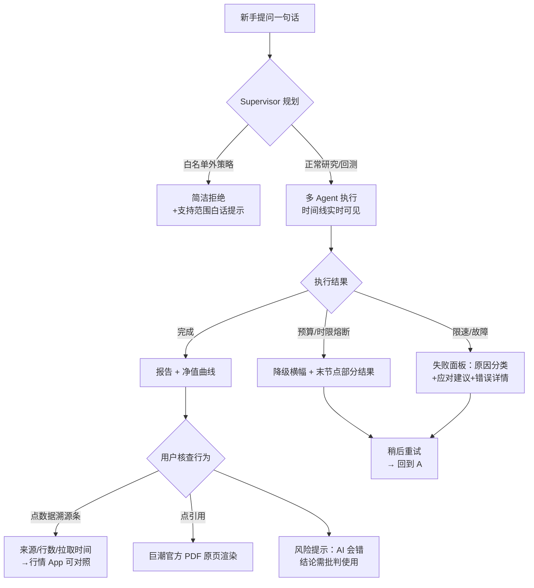

# AlphaDesk 产品文档（AI 产品经理定位版）

> 版本 v1.0（2026-08-17）｜需求访谈：AI 编码助手提问 16 项，决策人＝本人逐题拍板（留痕于会话记录，provenance「AI 初稿+人工决策」模式）
> 产品形态：http://43.156.248.38（线上）｜本文档面向 **AI 产品经理岗位**的求职作品，与工程文档（PRD/ADR/蓝图 v37）互为表里。

## 一、背景

- **项目性质（如实）**：个人求职作品——不虚构商业目标与用户规模，以 PM 方法论完整解构一个**已上线的 AI 投研产品**的产品面；工程侧由 AI 编码助手按本人蓝图实现，产品决策（本表全部 16 项）由本人做出。
- **行业背景**：大模型正在改造投研信息工作流——通用对话产品（Kimi/DeepSeek 等）能聊投资但**数字不可核查**；传统行情工具（问财等）能查数据但**没有可信的解释链**。「AI 生成内容可信度」是金融场景落地的第一道墙。
- **产品切口**：以「可核查的证据链」为核心主张切入 AI 投研助手——每个数字可溯源到接口拉取记录，每个年报数字可点开官方 PDF 原页，每个失败如实报告而非编造。

## 二、目标用户

| 层级 | 画像 | 说明 |
|---|---|---|
| **第一用户** | **入门级投资新手**：基本不懂专业分析，但会问 AI、想看看 AI 的看法 | 会提问但不会验证——**最需要「可信」却最缺乏辨别能力的群体**；决定了产品语言必须白话、边界必须显性 |
| 次要用户 | 求职评审者（面试官）：用专业标准审视产品完整性 | 决定了工程完备性（评测/备份/监控）同样是产品的一部分 |
| 明确非目标 | 专业量化研究员（需要多标的/自定义指标/实盘） | 超出当前白名单设计，不做过度承诺 |

**核心洞察（PM 判断）**：新手最缺的不是信息（信息已经过载），而是**可信的解读**。效率是入口（一句话提问），可信是留存（敢用、敢回来）。

## 三、用户痛点（按优先级）

1. **研究效率低（第一痛点）**：想了解一只股票要翻行情 App + 搜索 + 研报几小时，且拼不出完整结论——一句话获得结构化分析是基本预期
2. **AI 不可信（第一顾虑）**：通用 AI 报告"看起来很专业"但数字来源不明、无法验证——**敢不敢信决定敢不敢用**
3. 回测门槛高：不会写代码——白名单 + 自然语言翻译降低门槛
4. 过程黑盒：不知道 AI 怎么得出结论——执行时间线 + 事件回放

## 四、功能清单与优先级

| 优先级 | 功能 | 现状 | 说明 |
|---|---|---|---|
| **P0** | 一句话投研报告（真实行情+结构化+假设脚注） | ✅ 已上线 | 核心价值交付 |
| **P0** | 白名单策略回测（自然语言→DSL→净值曲线+指标） | ✅ 已上线 | 效率痛点的第二场景 |
| **P0** | **可核查引用**：[[doc#页]] 点开官方 PDF 原页 + 数据溯源条（来源/行数/拉取时间） | ✅ 已上线 | **差异化主打**——可信主张的物理证据 |
| P1 | **新手教育模式**：结合方法论库解释术语与风险，报告附带"这段结论怎么理解" | 🔲 未做（Roadmap） | 与第一用户最匹配的延伸：从"给答案"到"教理解" |
| P1 | 边界白话化：拒绝文案/DSL 术语改为新手友好表达 | 🔲 部分待改 | **做减法决策**：白名单术语对新手是黑话 |
| P2 | 用户文件上传进知识库 | 🔲 未做 | 版权审核与文件校验成本高，M5 富余再议 |
| P2 | 多标的组合分析 | 🔲 未做 | 白名单解锁项，非新手核心场景 |
| P3 | 定时报告订阅 | 🔲 未做 | 依赖推送通道与合规审视 |

## 五、核心流程图

**体验设计要点**：每个非理想分支（拒绝/降级/失败）都有明确的出口与再入口——**失败体验是产品的一部分**。

## 六、边界条件（产品口径）

| 边界 | 口径（本人拍板） | 实现现状 |
|---|---|---|
| **最易误解点：AI 会错** | 数字可核查 ≠ 结论正确——需最显眼的沟通位，引导批判使用 | 页脚声明已有，位置与强度待 A/B 验证 |
| 拒绝的表达 | **简洁拒绝**：直接说支持范围，不啰嗦（教育功能留给 P1 教育模式承载） | 白名单拒绝 + 支持范围提示已上线；文案白话化待改 |
| 数据源切换透明度 | **透明但降噪**：来源如实展示（东财/腾讯/缓存），技术细节折叠不吓唬新手 | 溯源条已实现；折叠交互待做 |
| 限速失败体验 | **失败 + 建议重试**（诚实优先，不做排队假象） | v35 失败面板已上线（分类+建议+详情） |
| 非投资建议 | 所有输出为研究演示 | 页脚+报告脚注双声明 |
| 回测≠未来 | 假设边界脚注随报告展示 | 已上线（next_close 口径等） |

## 七、埋点方案（北极星与事件表）

### 北极星指标：**复访/复用率**（同一用户二次提交任务的比率）
> 选型理由：完成率衡量单次交付，核查率验证可信主张被使用——**只有复访证明"敢用之后还愿意回来"**，是效率+可信双主张的汇合点。

### 事件表（按本人选择的优先组）

| 组别 | 事件 | 触发 | 参数 | 用途 |
|---|---|---|---|---|
| 基础（必埋） | task_submit / task_terminal | 提问 / 终态 | input_len、status、duration、degraded_reason | 漏斗主链路、北极星分母 |
| **优先组①：失败与重试** | fail_panel_view / retry_click | 失败面板曝光 / 点重试 | fail_type（限速/余额/中断/数据） | 失败体验优化的直接依据；重试转化率 |
| **优先组②：内容交互深度** | report_scroll_depth / chart_hover / report_read_complete | 滚动 25/50/75/100% / 图表交互 / 读到底 | task_id、depth | 内容质量代理指标——喂给教育模式的内容排序 |
| 次优先 | provenance_view / citation_click / pdf_page_open | 溯源条曝光点击 / 引用点击 / 原页打开 | source、symbol | 验证可信主张使用率（AB 期升级为主指标） |

### A/B 实验（若只做一个）：**风险提示位置**
报告顶部 vs 底部 vs 悬浮放置「AI 会错」提示 → 对比新手误解率（复访中重复询问同一标的且完全采信行为）与完读率。**假设**：新手完读率底部最高但记忆最弱，顶部最强但干扰阅读——验证「最易误解点」的最优沟通位。

### 指标分层（口径纪律）
- **对内看效率**：任务时长、Agent 步数、重试次数、失败率（免费层波动大，不对外承诺）
- **对外看信任**：核查行为率、引用点击率、复访率（与可信主张对齐，可承诺口径）

### 现状与差距（如实）
后端 Prometheus 已有技术指标（任务终态/预算熔断/限流/事件失败等 12 项，`/metrics` 采集）；**前端行为埋点（本表）为设计稿，未实施**——列为 M7+ 工程项。

## 八、PM 面试要点（本项目的产品叙事）

1. **一句话**：我做了一个面向投资新手的 AI 投研产品，核心主张是可信——每个数字可溯源、每个引用可点开原页、每个失败如实报告
2. **16 项产品决策全部本人拍板**（定位/用户/痛点/MVP/roadmap/边界/北极星），需求访谈记录可查——"用 PM 流程做 PM 作品"
3. 数据素养：北极星选复访率（而非虚荣的完成量）＋指标分层纪律（内效率外信任）＋假设驱动的 AB 设计
4. 取舍能力：做减法（白名单术语白话化）、P1 选教育模式（与新手用户定位自洽）、拒绝选简洁（教育归教育模式）
5. 工程共情：与 AI 编码助手协作交付（蓝图驱动+验收复盘），理解技术边界的成本——跨职能协作的实证
